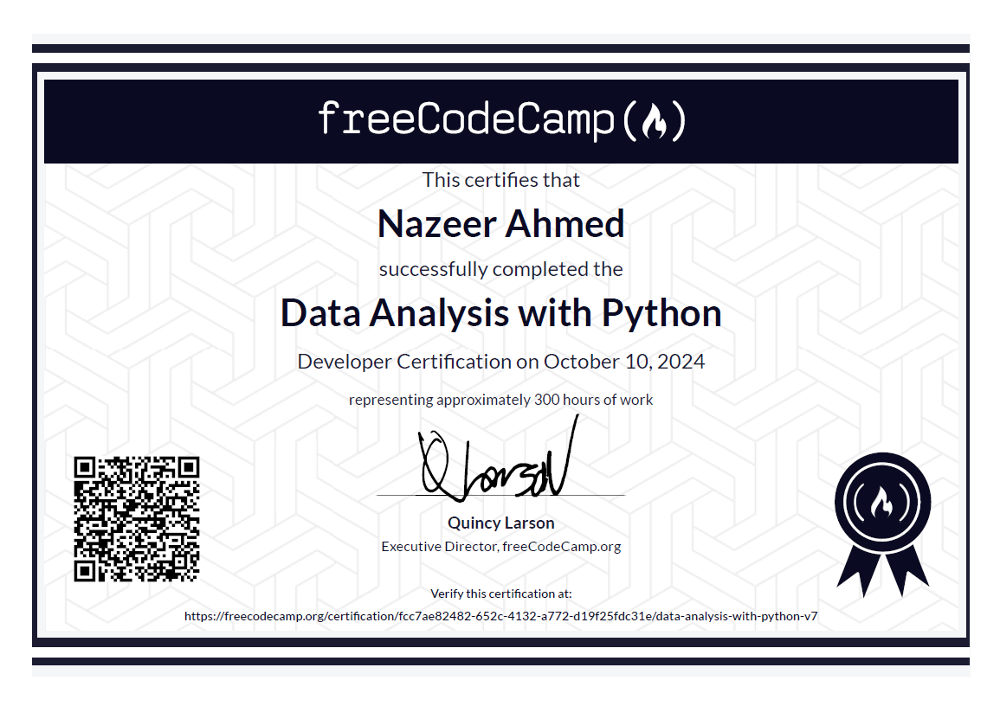

# Data-Analysis-with-Python
This repository contains the projects submitted for the **Data Analysis with Python** Certificate from **FreeCodeCamp**. Through these projects, I gained hands-on experience in **Python** and its essential libraries for data analysis, namely **NumPy**, **Pandas**, and **Matplotlib**. 

 

## References
- <a href="https://www.freecodecamp.org/learn/data-analysis-with-python/">FreeCodeCamp Data Analysis with Python</a>
